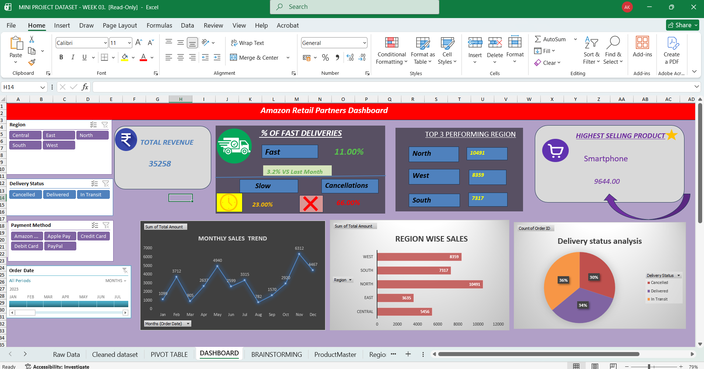

# Amazon Retail Partners – Sales & Delivery Analysis Dashboard

## 📊 Project Overview

This project presents an interactive **Sales & Delivery Analysis Dashboard** created using Microsoft Excel.

The dashboard analyzes sales performance, regional revenue, delivery status, cancellation rates, fast deliveries, and top-selling products to generate meaningful business insights.

## 🛠️ Tools & Techniques

- Microsoft Excel
- Pivot Tables
- XLOOKUP
- Charts
- Slicers
- Data Analysis
- Data Visualization
- KPI Analysis

## 📈 Key Insights

- **North region** generated the highest revenue.
- **Smartphone** was the highest-selling product category.
- Delivery status was analyzed across **Delivered, In Transit, and Cancelled** orders.
- Fast delivery performance was evaluated.
- Regional sales performance was compared.
- Cancellation trends were analyzed to identify areas for improvement.

## 📊 Dashboard Preview

## 📁 Project Files

### 📊 Excel Dashboard
[View / Download Excel Workbook](./MINI%20PROJECT%20DATASET%20-%20WEEK%2003..xlsx)

### 📄 Insight Report
[View Insight Report](./Aditya%20kumar%20INSIGHT%20REPORT.pdf)

### 🖼️ Dashboard Preview
[View Dashboard Image](./dashboard-preview.png.png)

## 🎯 Project Objective

The objective of this project was to transform sales and delivery data into meaningful business insights using Microsoft Excel.

The dashboard helps understand regional sales performance, product performance, delivery status, and cancellation trends for better business decision-making.

## 💡 Business Recommendations

- Focus on improving delivery performance in regions with higher cancellation rates.
- Increase fast delivery services to improve customer satisfaction.
- Monitor delayed orders to reduce cancellations.
- Focus on high-performing product categories such as smartphones.

## 👨‍💻 Created By

**Aditya Kumar**

Aspiring Data Analyst | Excel | SQL | Power BI
